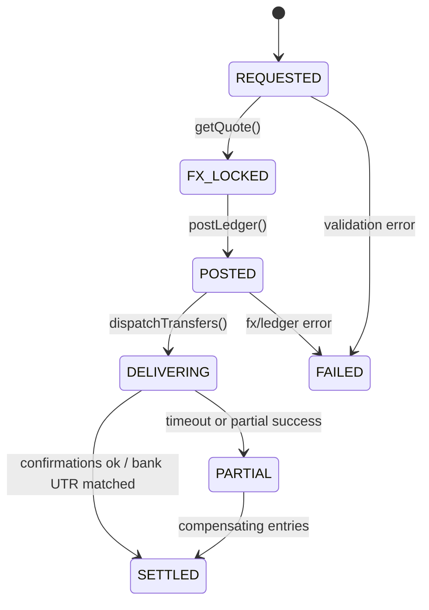

# Delivering Seamless Multi-Currency Settlements with INR and USDT Integration

Merchants operating across regions often need fast settlement in multiple currencies. We built **multi-currency settlements** supporting **INR** and **USDT** while maintaining strict **reconciliation**, **FX disclosure**, and **regulatory compliance**. The result: predictable payouts, transparent fees, and simplified treasury operations for high-volume merchants.

---

## 1) Problem Statement

- Merchants wanted **T0/T1 settlements** in INR while also receiving a portion in **USDT** for cross-border treasury needs.  
- FX rates and fees were opaque, leading to reconciliation disputes.  
- Blockchain confirmations introduced timing variability; we needed **deterministic ledgers** that do not depend on chain timing for accounting states.  
- Regulatory rules and merchant-specific limits required granular controls.

---

## 2) Objectives

1. **Unified ledger** for INR and USDT with clear state transitions.  
2. **Deterministic reconciliation** independent of network confirmation timing.  
3. **Transparent FX** with locked quotes + slippage limits.  
4. **Operational safety**: retry-safe workflows and two-person approvals for risky actions.  
5. **Merchant experience**: one dashboard, predictable schedules, instant status.

---

## 3) System Architecture (High Level)

- **Core Services**
  - **Settlement Orchestrator (NestJS)**: state machine for payouts and FX legs.  
  - **FX Service**: quotes, locks, and execution; supports multiple LPs.  
  - **Ledger Service (PostgreSQL)**: double-entry journal, multi-asset, idempotent writes.  
  - **Crypto Gateway**: USDT on/off-ramp, hot wallet monitor, sweep jobs.  
  - **Risk & Limits Engine**: per-merchant velocity, per-asset caps, sanction checks.  

- **Data Plane**
  - **Redis + BullMQ** for async jobs (quote lock expiry, sweep, confirmations).  
  - **S3** for immutable statements (PDF/CSV) and signed artifacts.  
  - **New Relic + Prometheus** for SLOs and incident insights.

---

## 4) Double-Entry Ledger (Multi-Asset)

Each journal entry has `{asset, amount, dr_account, cr_account, refId, refType}`.  
We enforce **idempotency** on `(refType, refId)` to prevent duplicate postings.

### Example: INR → USDT FX + Settlement
1. Merchant Balance (INR) → FX Reserve (INR)  
2. FX Reserve (INR) → FX Reserve (USDT) (at locked rate)  
3. FX Reserve (USDT) → Merchant Payout (USDT)

All three legs are **posted atomically** within a transaction; external transfers (chain) do not block the ledger posting but affect **delivery status**.

```sql
-- simplified posting sketch
BEGIN;
-- lock fx quote id=Q123 valid_until=...
INSERT INTO journal (...); -- INR -> FX_INR
INSERT INTO journal (...); -- FX_INR -> FX_USDT (using rate, fee)
INSERT INTO journal (...); -- FX_USDT -> MERCHANT_PAYOUT_USDT
COMMIT;
```

---

## 5) FX Handling

- **Quote Sources**: multiple LPs with median pricing, outlier rejection.  
- **Quote Lock**: 90 seconds by default; **slippage guard** (e.g., 30 bps).  
- **Disclosure**: merchant sees `spot`, `spread`, `network fee`, `final`.  
- **Fallback**: if execution deviates beyond guardrails, the orchestrator cancels and re-quotes automatically.

```ts
type Quote = {
  id: string;
  base: "INR";  // payin currency
  counter: "USDT";
  spot: number;
  spreadBps: number;
  fee: number;
  expiresAt: string;
};
```

---

## 6) USDT On/Off-Ramp & Wallet Safety

- **Hot Wallet** for immediate payouts with min reserve; automatic **sweeps** to cold storage.  
- **Allowlist Addresses** per merchant; optional **memo/tag** enforcement.  
- **Chain Listeners** publish events; confirmations are **observed** but not **required** for accounting posting.  
- **Re-issue & Retry** idempotency through a stable `payoutId` bound to the journal entries.

---

## 7) Limits, Risk, and Compliance

- Velocity limits by **day/week**, per asset.  
- Sanction list checks on wallet addresses and merchant entities.  
- **Two-person approval** for large USDT payouts and bank updates.  
- PCI-DSS scope minimized by isolating card artifacts from settlement stack.  
- Country rules: configurable **asset availability** per merchant region.

---

## 8) Reconciliation Model

We produce three layers of statements:

1. **Operational Ledger Statement** — canonical journal by day/asset.  
2. **Bank Statement Reco** (INR) — amount + UTR matching vs. bank CSV.  
3. **Chain Reco** (USDT) — tx hash, confirmations, fee audit.

A **Reconciliation Runner** correlates journal entries with external statements using deterministic keys and tolerances (time, amount, fee deltas). Failures open tickets automatically.

---

## 9) Failure Modes & Recovery

- **FX Timeout**: quote expires → auto re-quote; ledger rolled back.  
- **Chain Congestion**: payout posted in ledger, **delivery** stays `pending`; SLA policy escalates with fee bump.  
- **Bank Downtime**: INR leg queued; merchants see ETA with reason codes.  
- **Partial Success**: compensating postings (reversal entries) applied via new journal batch, never overwrite history.

---

## 10) Merchant UX (Next.js + Tremor)

- One timeline: **Requested → FX Locked → Posted → Delivering → Settled**.  
- Side panel reveals **fees**, **spot rate**, **spread**, and **hash/UTR**.  
- Exportable **PDF/CSV** for auditors.  
- Webhooks + Slack/Telegram alerts for state transitions.

---

## 11) Results

| Metric | Before | After |
|------:|------:|------:|
| Avg settlement cycle (USDT) | 6–12h | 45–90m |
| FX dispute tickets | High | Near-zero |
| Manual reconciliations | Frequent | Rare |
| Failed payouts resolved | Days | Hours |

---

## 12) Lessons Learned

1. **Post first, deliver next**: separate accounting finality from network finality.  
2. **Make FX explicit**: line-item every fee and spread.  
3. **Idempotency everywhere**: reference keys across FX, ledger, payouts.  
4. **Automate re-co**: humans approve exceptions, not routine matches.

---

## 13) What’s Next

- **Stablecoin diversity** (USDC) with automatic route selection.  
- **Rule-based routing** (time-of-day, chain congestion).  
- **Account-level hedging** to keep USD value stable across days.  
- **Anomaly detection** for FX and payout patterns.

---

### Appendix A — Orchestrator State Machine (Sketch)



---

*Authored by the Protize Engineering Team — November 2025.*
